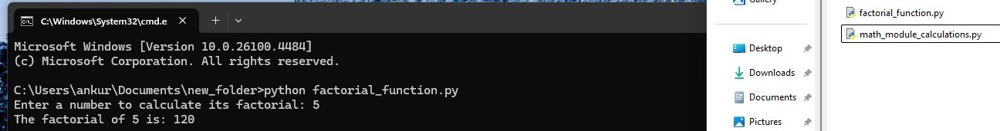
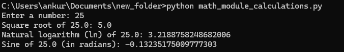

# Assignment 3: Module 4 – Functions and Modules in Python

## Task 1: Calculate Factorial Using a Function
- Enter a number to calculate an integer argument
- Calculates the factorial using a loop
- Returns and displays the result of factorial integer 5
- The factorial of 5 Result 120 

## Task 2: Math Module Calculations
- Asks the user to enter a number
- If the number is greater than 0
- It calculates and shows the square root of the number 25.0: 5.0
- It calculates and shows the natural logarithm (ln) of 25.0: 3.2188758248682006
- It calculates and shows the sine of the number 25.0 (in radians)
- If the number is 0 or negative, it shows a message saying that the logarithm can't be calculated.
- If the user enters something that's not a number, it shows an error message.
